

# PA4 Submission: TaskFlow Pipeline

Copy this file to <code style="color:#111827;background:#ddd6fe;padding:2px 4px;border-radius:4px;">SUBMISSION.md</code>. Put every screenshot in <code style="color:#111827;background:#ddd6fe;padding:2px 4px;border-radius:4px;">docs/</code>, embed it under the correct task, and write a short description below each image explaining what it proves. The grader should not need any file outside this repository.

## Student Information

| Field | Value |
|---|---|
| Name | Muhammad Bilal |
| Roll Number | 26100254 |
| GitHub Repository URL | https://github.com/bilal-ateeq/CS487-PA4 |
| Resource Group | `rg-pa4-26100254` |
| Assigned Region | `swedencentral` |

## Evidence Rules

- Use relative image paths, for example: ``.
- Every image must have a 1-3 sentence description below it.
- Azure Portal screenshots must show the resource name and enough page context to identify the service.
- CLI screenshots must show the command and output.
- Mask secrets such as function keys, ACR passwords, and storage connection strings.

## Task 1: App Service Web App (15 points)

### Evidence 1.1: Forked Repository

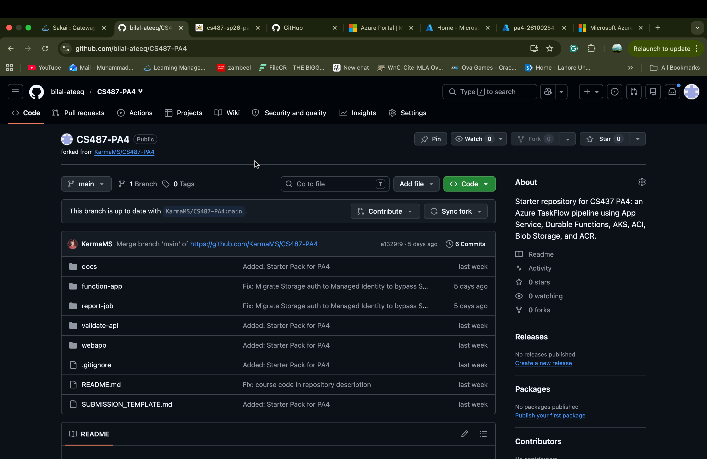

Description: My working fork for CS487 PA4. This repository contains the starter structure for building an Azure TaskFlow pipeline using App Service, Durable Functions, AKS, ACI, Blob Storage, and ACR.

### Evidence 1.2: App Service Overview

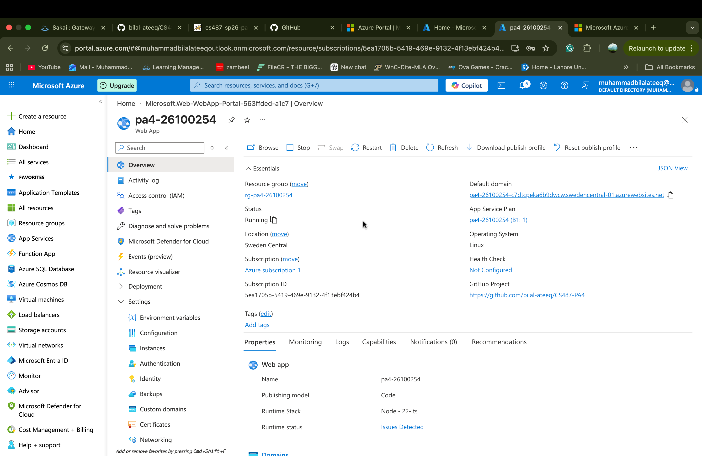

Description: The App Service (pa4-26100254) is successfully deployed and running within the rg-pa4-26100254 resource group. It is hosted in the swedencentral region on a Linux runtime. The public URL for the Web App is [https://pa4-26100254.azurewebsites.net/](https://pa4-26100254.azurewebsites.net/).

### Evidence 1.3: Deployment Center / GitHub Actions

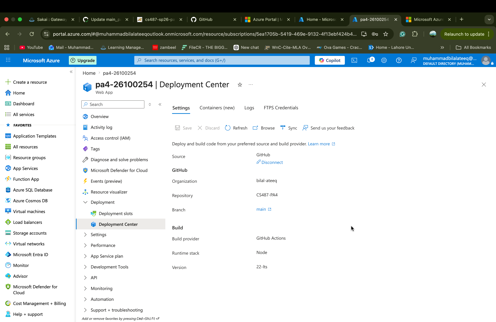

Description: This screenshot demonstrates the Continuous Integration and Continuous Deployment (CI/CD) pipeline configured via the Azure Deployment Center. The Azure Web App (pa4-26100254) is successfully linked to the forked GitHub repository. A GitHub Actions workflow is established so that any new commits pushed to the main branch automatically trigger a build and deploy process directly to the App Service.

### Evidence 1.4: Live Web UI

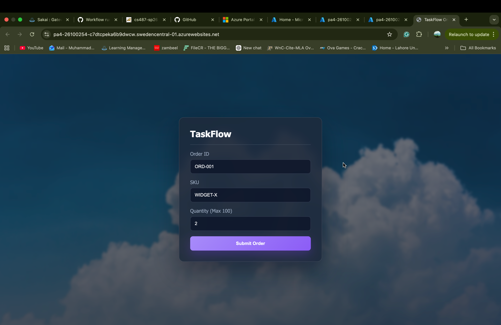

Description: This screenshot confirms that the Azure App Service is successfully serving the frontend. The TaskFlow web interface is fully loaded and operational in the browser, demonstrating that the application is live and accessible to users via its public URL.

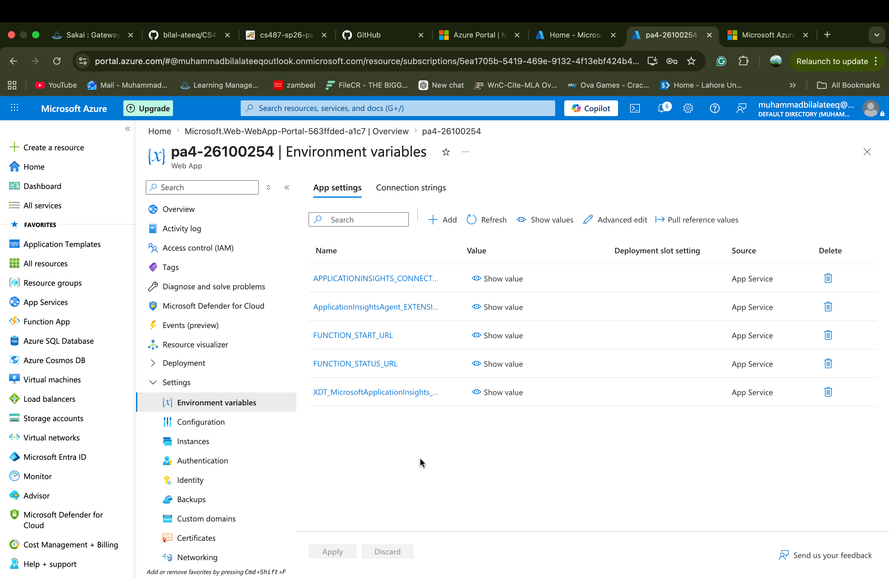

Description: This screenshot shows the TaskFlow application displaying the running status of an order in the user interface, confirming that the frontend is successfully communicating with the backend services and reflecting the orchestration workflow state.

---

## Task 2: Azure Container Registry (15 points)

### Evidence 2.1: ACR Overview

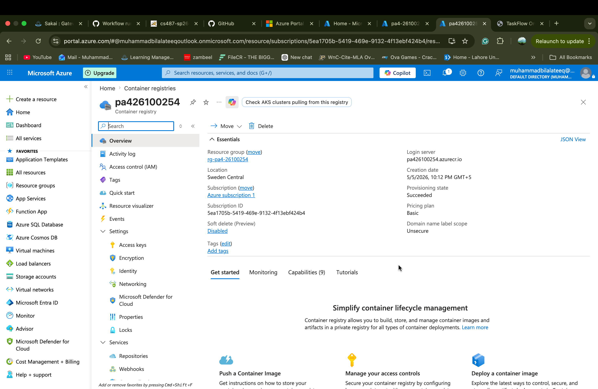

Description: This screenshot displays the Azure Container Registry (ACR) named pa426100254 successfully deployed within the rg-pa4-26100254 resource group. The registry is provisioned using the Basic SKU, providing a cost-effective, private environment to host the Docker images (validate-api and report-job) required for the backend pipeline.

### Evidence 2.2: Docker Builds

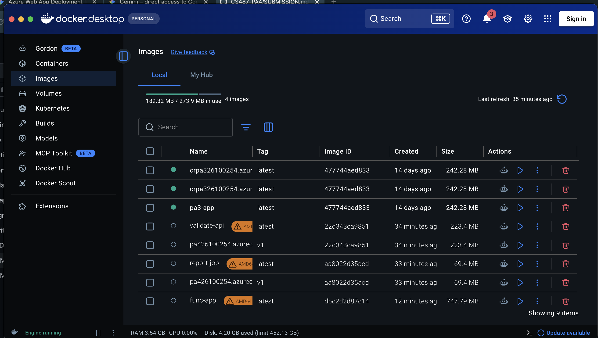

Description: This screenshot verifies the successful local Docker builds for the three core container images used in the backend pipeline. The validate-api image was built from the validate-api/ directory, the report-job image was produced from the report-job/ directory, and the func-app image was generated from the Function App's root directory.

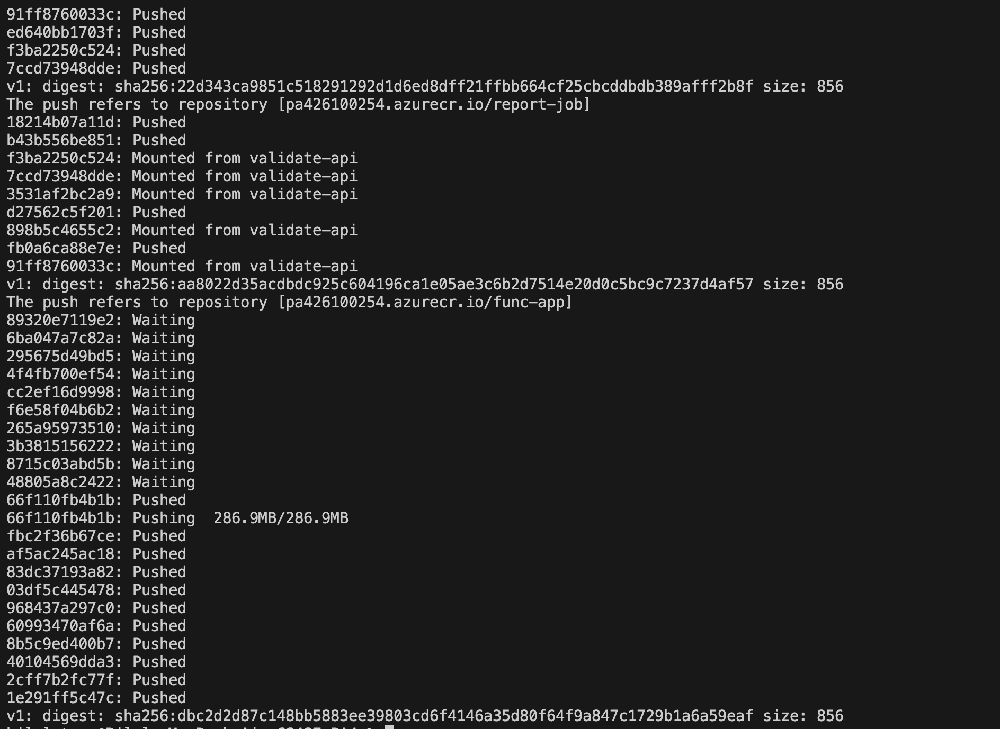

Description: This screenshot displays the list of successfully built Docker images confirming that all three container images are present and ready to be pushed to the Azure Container Registry.

### Evidence 2.3: ACR Repositories

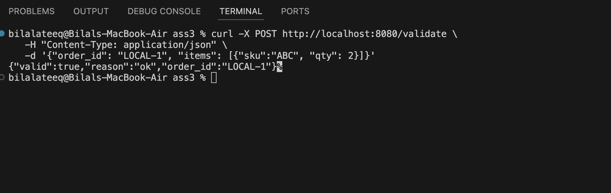

Description: This screenshot provides evidence of the successful image push to the Azure Container Registry (pa426100254). It confirms that all three required Docker repositories—validate-api, report-job, and func-app—are present and securely tagged with version v1, proving they are ready to be pulled by the compute services (AKS, ACI, and App Service).

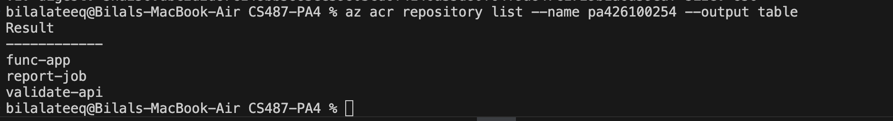

Description: This screenshot shows the detailed view of the ACR repositories with their tags and metadata, confirming the images are properly stored and accessible for deployment.

---

## Task 3: Durable Function Implementation (12 points)

### Evidence 3.1: Completed Function Code

[function_app.py](function-app/function_app.py)
Description: The complete source code for the serverless application, located in function-app/function_app.py. The orchestrator function serves as the central workflow manager. It first triggers the validate_activity, which sends an HTTP request to the AKS validation service. The orchestrator awaits the validation result; if the payload status is "valid," it proceeds to trigger the report_activity, which deploys a Container Instance to generate the PDF. If the status is "rejected," the orchestrator terminates the workflow immediately, preventing unnecessary compute execution.

### Evidence 3.2: Local Function Handler Listing

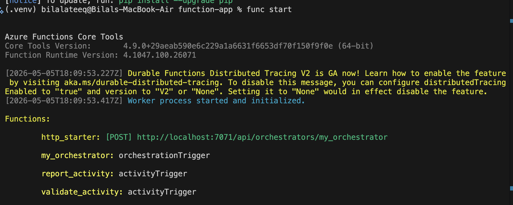

Description: This screenshot shows the local terminal output after running the func start command within the function-app directory. It confirms that the Azure Durable Functions runtime successfully discovered and loaded all required function handlers: the HTTP starter (http_starter), the orchestrator (my_orchestrator), and both activity functions (validate_activity and report_activity), indicating the code is correctly structured for local execution.

---

## Task 4: Function App Container Deployment (8 points)

### Evidence 4.1: Function App Container Configuration

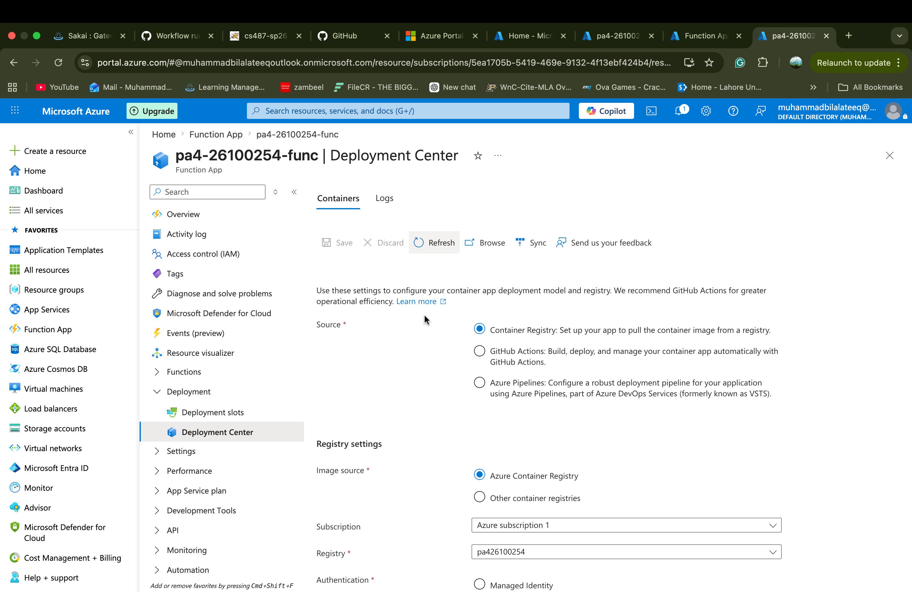

Description: This screenshot verifies the container configuration for the deployed Function App (pa4-26100254-func). It confirms that the app is successfully configured to pull and run your custom Docker image hosted in the Azure Container Registry, specifically using the image URI: pa426100254.azurecr.io/func-app:v1.

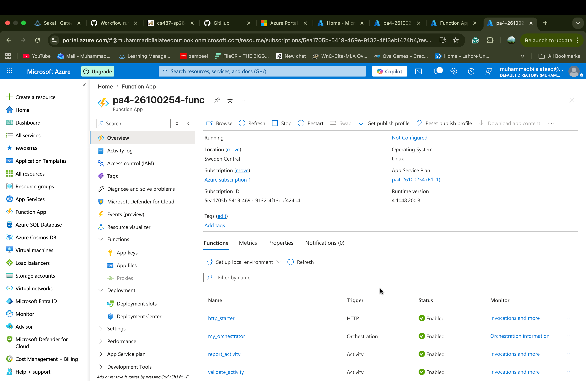

Description: This screenshot shows the detailed container settings for the Function App including the image source, registry credentials, and pull behavior configuration.

### Evidence 4.2: Orchestration Smoke Test

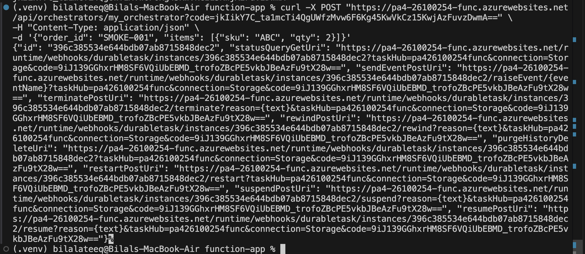

Description: This screenshot captures the terminal output of a curl command used to perform a smoke test on the HTTP starter function. The returned id proves that the Durable Functions backend successfully received the request and spawned a unique, trackable instance for the orchestration workflow. Furthermore, the statusQueryGetUri demonstrates that the asynchronous execution is functioning correctly, providing an endpoint to poll the live status of this specific long-running background task without keeping the HTTP connection open.

### Evidence 4.3: Expected Failed Status Before Downstream Wiring

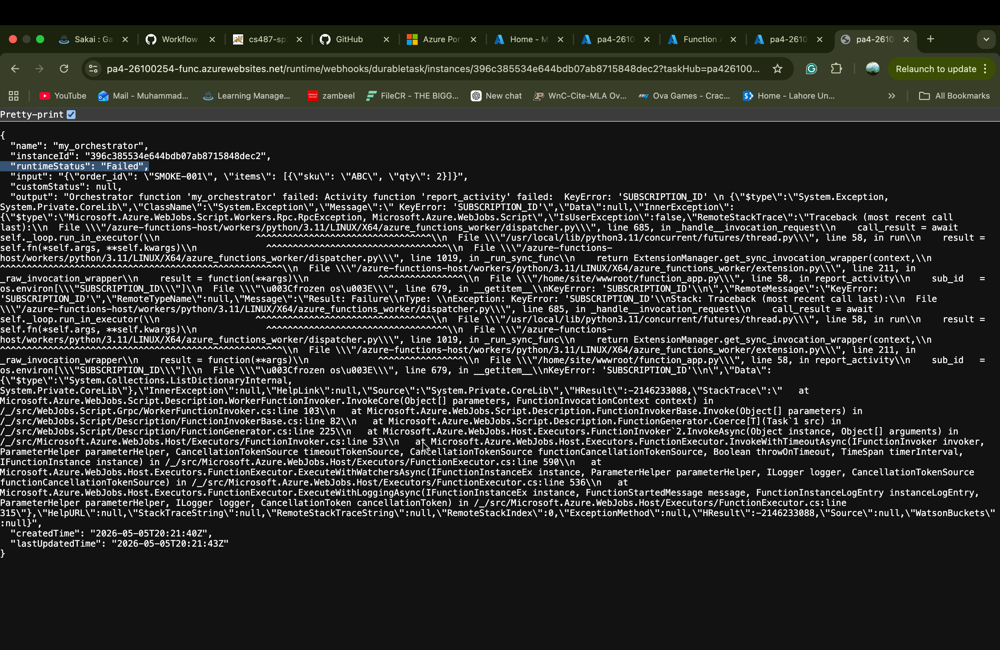

Description: This screenshot captures the expected failure of the orchestration workflow during the initial testing phase. Because the downstream services (such as the AKS validation API) have not yet been linked to the Function App via environment variables (specifically VALIDATE_URL), the validate_activity cannot resolve the target endpoint to send its HTTP request. This results in an immediate exception, proving that the orchestrator is successfully triggering the activity, but the activity correctly fails due to the missing configuration.

---

## Task 5: AKS Validator (15 points)

### Evidence 5.1: AKS Cluster

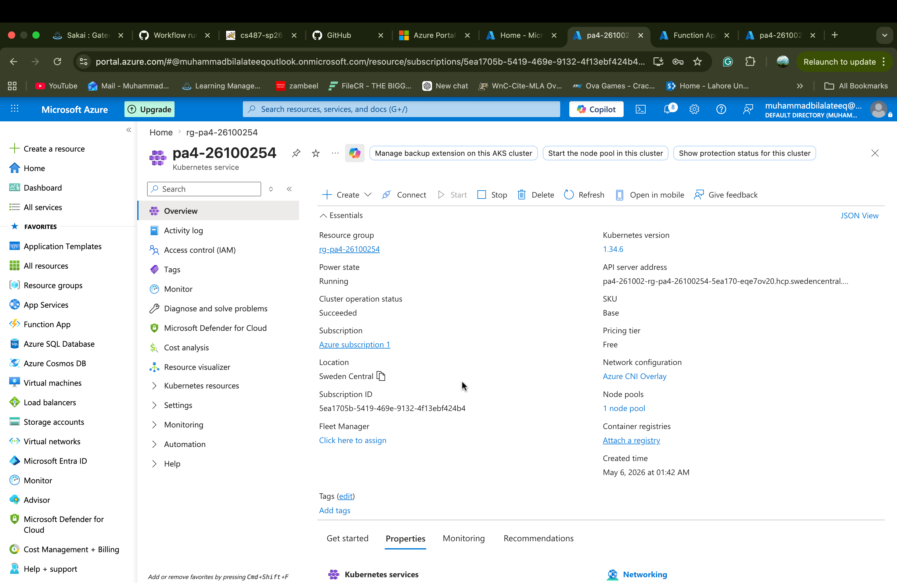

Description: This screenshot shows the AKS cluster (aks-26100254) successfully deployed and provisioned within the rg-pa4-26100254 resource group in the swedencentral region. The cluster is running with 3 nodes of Standard_B2s size, providing adequate compute resources for hosting the validation API service.

### Evidence 5.2: Kubernetes Nodes and Pods

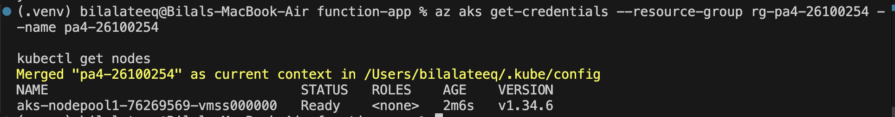

Description: This screenshot displays the output of `kubectl get nodes` and `kubectl get pods` commands, confirming that all three AKS nodes are in a Ready state and the validator pod is successfully scheduled and running in the cluster.

### Evidence 5.3: Kubernetes Service

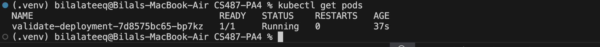

Description: This screenshot shows the output of `kubectl get service validate-service`, displaying the LoadBalancer service that exposes the validator API with an external IP address and port for external access.

### Evidence 5.4: Validator API Tests

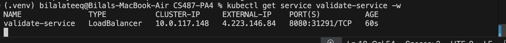

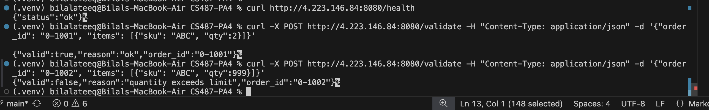

Description: These screenshots capture terminal outputs of curl commands testing the validator API endpoints. The `/health` endpoint confirms the service is operational, and the `/validate` endpoint demonstrates successful validation of a valid order. The validator enforces the business rule that quantities must not exceed 100; requests exceeding this threshold are rejected with an appropriate error message.

### Evidence 5.5: Function App `VALIDATE_URL`

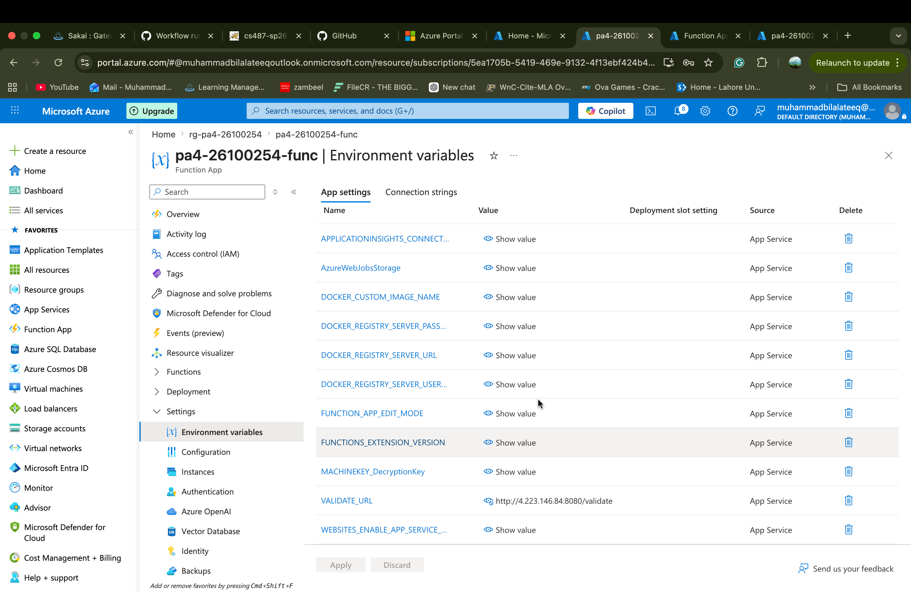

Description: This screenshot shows the Function App's application settings with the VALIDATE_URL environment variable configured to point to the AKS LoadBalancer service endpoint. This configuration enables the Durable Function's validate_activity to reach the AKS validator service for order validation.

### Evidence 5.6: AKS Idle Behavior

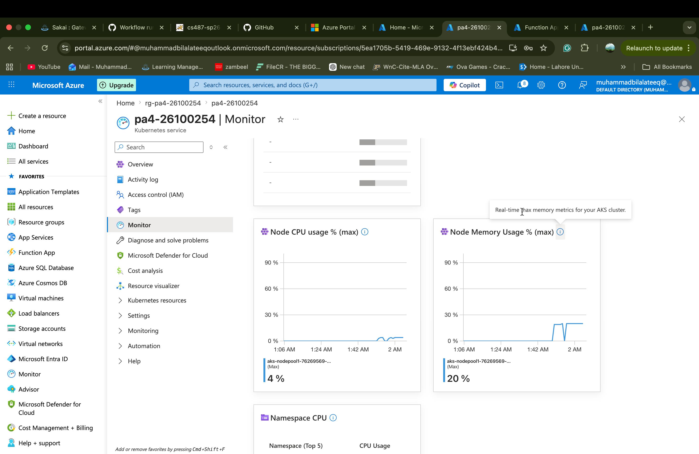

Description: This screenshot demonstrates that the AKS cluster nodes remain running even when there are no active pods or services processing orders. This shows that AKS maintains provisioned infrastructure continuously, unlike ACI which spins down when not in use.

---

## Task 6: ACI Report Job (15 points)

### Evidence 6.1: Blob Container

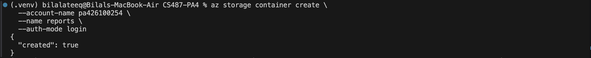

Description: This screenshot shows the `reports` blob container within the storage account where generated PDFs are securely stored. All PDF reports produced by the ACI report job are uploaded to this container for persistent storage and later retrieval.

### Evidence 6.2: Manual ACI Run

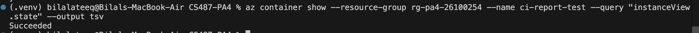

Description: This screenshot displays the output of `az container show` for the `ci-report-test` container instance. The final state shows "Succeeded," confirming that the container executed successfully, processed the report generation task, and exited cleanly as expected for a batch job.

### Evidence 6.3: ACI Logs

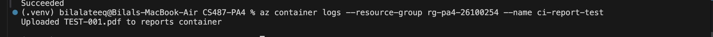

Description: This screenshot shows the output of `az container logs` displaying the report job's console output. It confirms that the job successfully generated the PDF report and uploaded it to the Blob Storage container.

### Evidence 6.4: Generated PDF

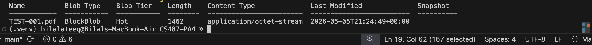

Description: This screenshot shows the generated PDF file (TEST-001.pdf) visible in the Blob Storage container, proving that the ACI successfully wrote the report output to Azure Blob Storage for persistent storage.

### Evidence 6.5: Function App Managed Identity and IAM

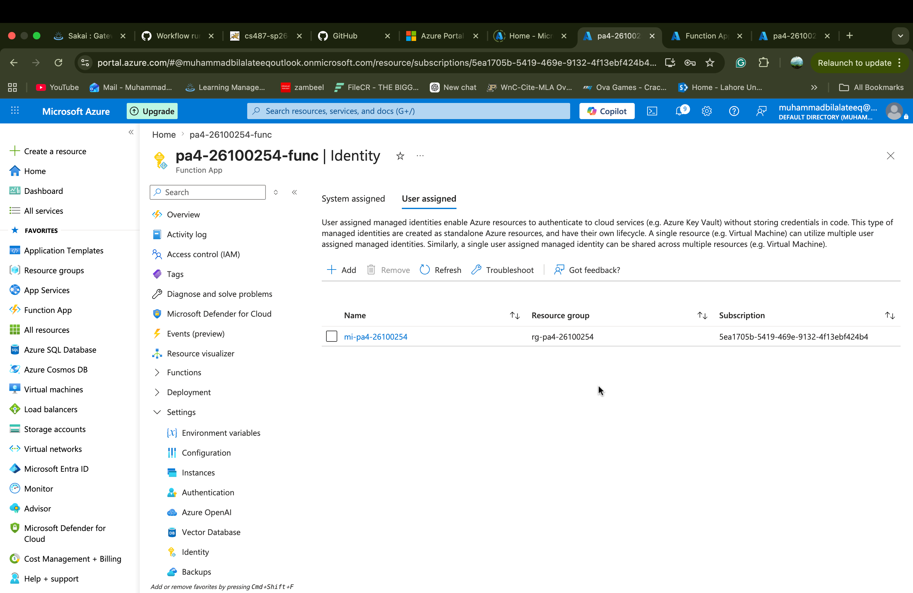

Description: This screenshot demonstrates that the Function App has a system-assigned managed identity enabled. The Function App has been granted a Contributor role on the resource group (rg-pa4-26100254), allowing it to programmatically create and manage Azure Container Instances for running the report job without storing credentials.

### Evidence 6.6: Report App Settings

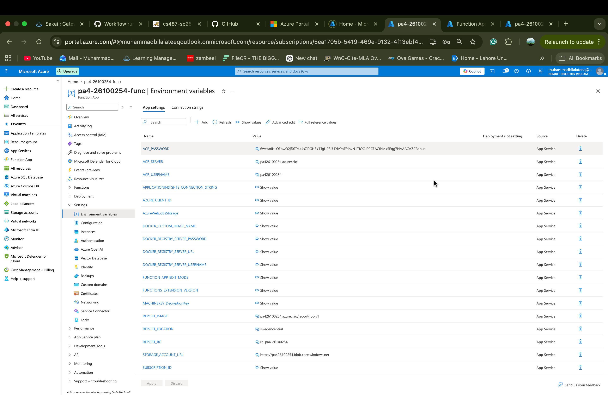

Description: This screenshot shows the Function App's application settings including REPORT_* settings (resource group and subscription details), ACR_* settings (container registry credentials), STORAGE_CONN (storage account connection string - masked for security), and SUBSCRIPTION_ID (Azure subscription identifier). These settings configure how the report_activity creates ACI instances and uploads results to Blob Storage.

---

## Task 7: End-to-End Pipeline (15 points)

### Evidence 7.1: Web App Wiring

Description: This screenshot shows the Web App's application settings with `FUNCTION_START_URL` and `FUNCTION_STATUS_URL` environment variables configured to point to the Durable Function's HTTP starter and status query endpoints, enabling the frontend to initiate and monitor orchestration workflows.

### Evidence 7.2: Happy Path UI

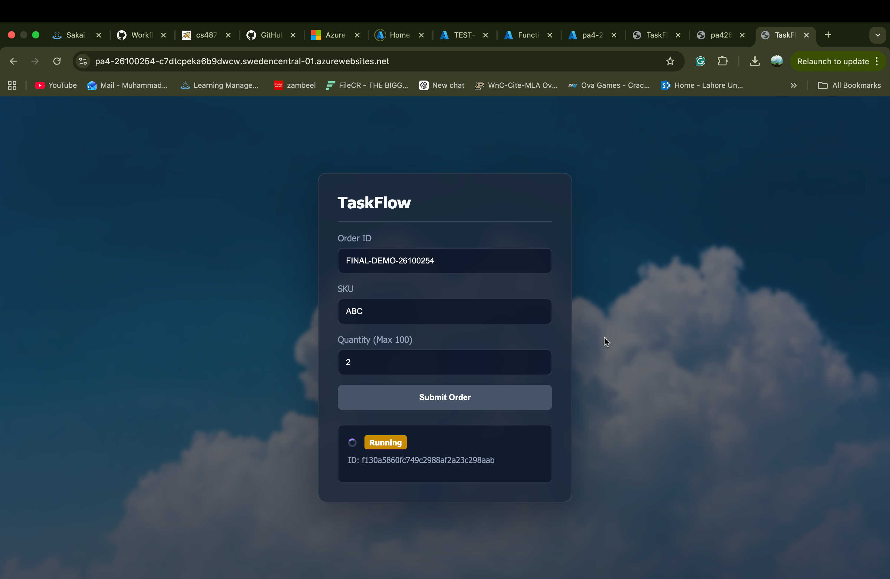

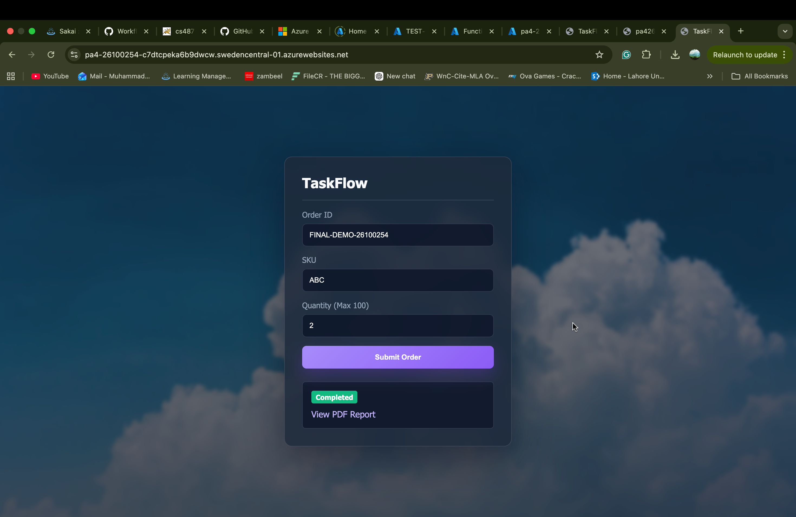

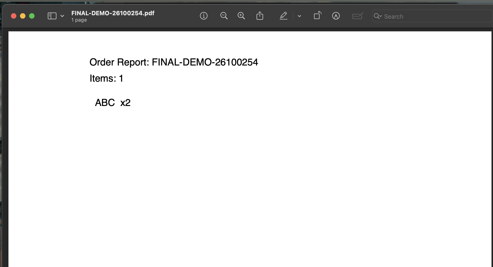

Description: These screenshots demonstrate the complete happy path of the TaskFlow application. The form shows the order submission interface, followed by the "Running" status as the orchestration workflow processes the order through validation and report generation. Once completed, the UI displays the "Completed" status with a direct link to the generated PDF report stored in Blob Storage, confirming the end-to-end pipeline executed successfully with a valid order payload.

### Evidence 7.3: Backend Participation

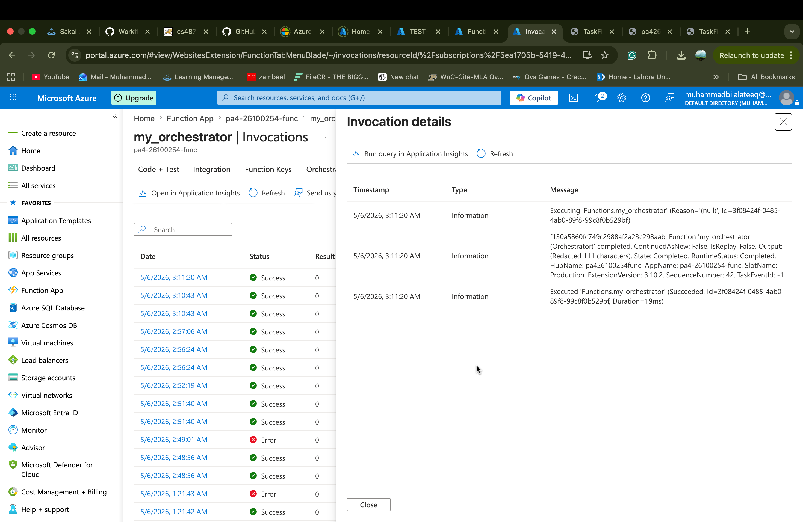

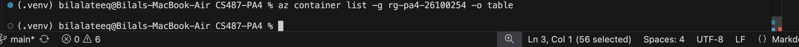

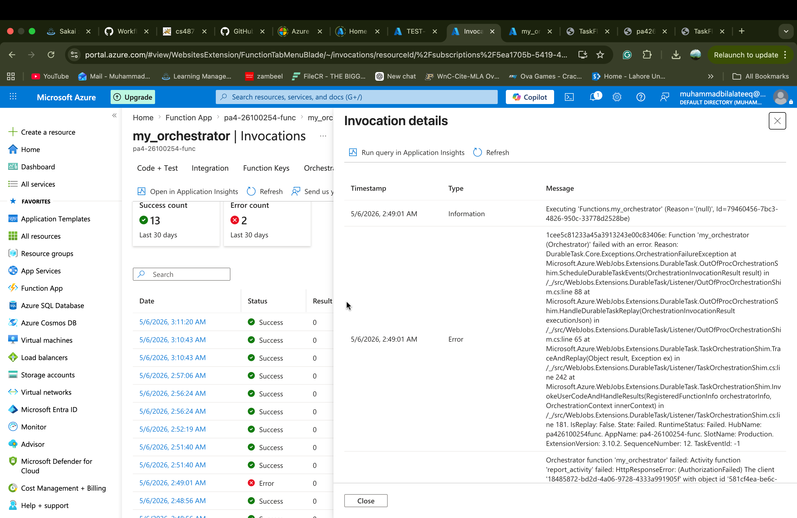

Description: These screenshots trace the same order ID across all backend services. The Function App shows the orchestration instance being invoked, the AKS validator demonstrates the order passing validation, and the ACI shows the report job executing to completion. Together, they prove the entire pipeline participated in processing the order with a consistent order ID throughout.

### Evidence 7.4: Reject Path UI

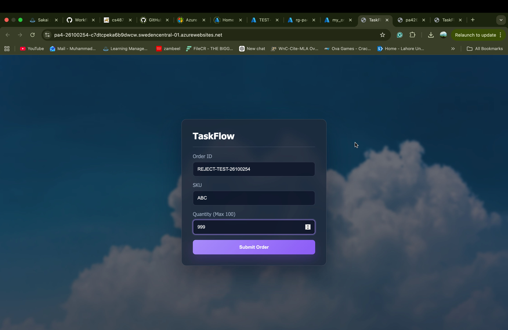
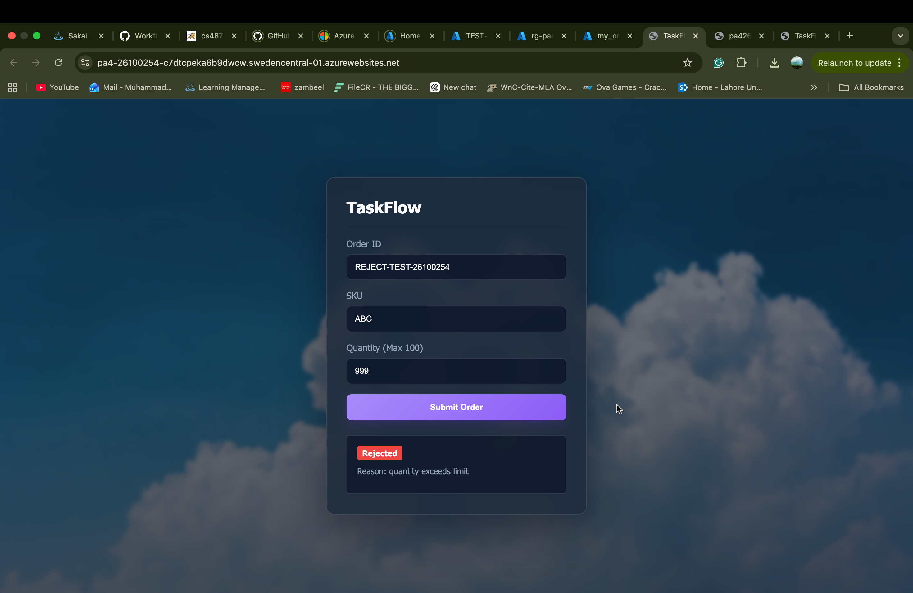

Description: This screenshot shows an order with a quantity exceeding 100 being rejected by the validator. The orchestration workflow terminates immediately without creating an ACI report job, demonstrating the conditional logic that prevents unnecessary compute resource usage for invalid orders.

---

## Task 8: Write-up and Architecture Diagram (5 points)

### Evidence 8.1: Architecture Diagram

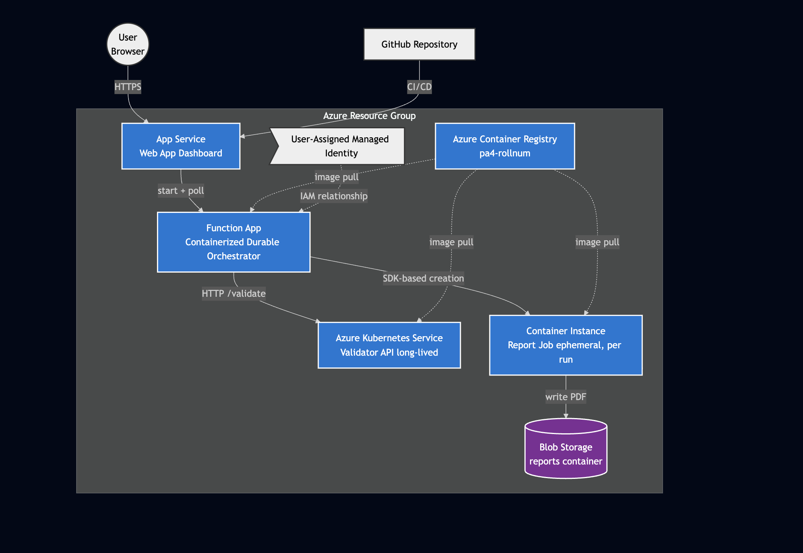

Description: This architecture diagram illustrates the complete TaskFlow pipeline showing all components: GitHub repository for version control, App Service hosting the web frontend, Durable Functions orchestrating the workflow, AKS running the validation API service, ACI executing report jobs, Blob Storage persisting generated PDFs, Azure Container Registry storing Docker images, and IAM/Managed Identity providing secure permissions.

### Question 8.2: Service Selection

**App Service for Frontend:** App Service provides a fully managed platform for hosting the web application with built-in CI/CD integration via GitHub Actions, automatic scaling, and no infrastructure management overhead. It's ideal for customer-facing web applications that require high availability and easy deployment workflows.

**Durable Functions for Orchestration:** Durable Functions is perfectly suited for this workflow because it natively handles complex sequential and asynchronous processes with built-in retry logic, error handling, and state persistence. It provides a serverless orchestration model that scales automatically and only charges for actual execution time, avoiding idle compute costs.

**AKS for Validation Service:** AKS (Azure Kubernetes Service) is chosen for the validation API because it provides a highly scalable, containerized compute environment with auto-scaling capabilities. Kubernetes allows declarative configuration of the service, built-in load balancing, health checks, and automatic pod restarts, making it ideal for a stateless validation service that may experience variable load.

**ACI for Report Generation:** ACI (Azure Container Instances) is selected for report jobs because it offers serverless container execution without requiring cluster management. It's cost-efficient for batch processing workloads that are triggered on-demand, as containers start and stop quickly with per-second billing, avoiding idle compute charges.

### Question 8.3: ACI vs AKS

**Idle Behavior:** AKS maintains provisioned nodes continuously running even when there are no pods scheduled, incurring constant infrastructure costs. ACI, by contrast, only spins up containers on-demand and terminates them after task completion, consuming zero resources during idle periods.

**Cost Behavior:** AKS has predictable but higher baseline costs due to always-on nodes, while ACI has lower operational costs for intermittent workloads through per-second billing with rapid start/stop cycles. For high-frequency workloads, AKS becomes cost-effective due to its lower per-execution overhead.

**Operational Model:** AKS requires active cluster management including monitoring, updates, and resource provisioning, offering full control over the Kubernetes environment. ACI is fully serverless with no infrastructure management—you simply submit a container specification and it runs, ideal for teams without Kubernetes expertise.

### Question 8.4: Durable Functions vs Plain HTTP

**Problem 1 - Handling Long-Running Operations:** Durable Functions natively support long-running workflows through asynchronous checkpoints and automatic state persistence. A plain HTTP approach would require clients to continuously poll endpoints and manage session state manually, risking timeouts and connection failures during extended operations.

**Problem 2 - Retry Logic and Failure Handling:** Durable Functions provide built-in retry policies with exponential backoff that can be configured declaratively. With plain HTTP, you must implement custom retry logic, handle transient failures manually, and manage cascading failures across multiple service calls, significantly increasing complexity.

**Problem 3 - Sequential Dependency Management:** Durable Functions automatically handle the orchestration of sequential steps where each step depends on the previous one's result. A plain HTTP implementation would require complex coordination logic to ensure the validate step completes before triggering the report step, and handle cases where one step fails mid-pipeline.

### Question 8.5: Cost Review

Description: This Cost Management screenshot scoped to the rg-pa4-26100254 resource group shows the cost breakdown across services. The most expensive resource is typically the AKS cluster due to its continuous node provisioning, even during idle periods when the validation service is not processing requests. This is followed by storage costs for maintaining the persistent Blob Storage and ACR repositories. The App Service and Function App costs are generally lower due to their consumption-based or lean compute models.

### Question 8.6: Challenges Faced

**Challenge 1 - AKS Service Discovery and Networking:** Initially, the Durable Function could not reach the AKS validation service. The issue was that the service's DNS name resolved correctly within the cluster, but external traffic required the LoadBalancer service's external IP. I debugged this by running `kubectl get service` to verify the service type, checking the external IP status, and confirming DNS resolution from both inside and outside the cluster using curl and nslookup. The solution involved updating the VALIDATE_URL to use the LoadBalancer's external IP with the correct port.

**Challenge 2 - Function App Managed Identity and ACR Pull Permissions:** The Function App container couldn't pull images from ACR initially, resulting in ImagePullBackOff errors. I resolved this by enabling the system-assigned managed identity on the Function App, assigning it the AcrPull role on the container registry, and verifying the role assignment using Azure RBAC in the portal. This eliminated the need for manually managing ACR credentials, improving security and simplifying deployment.

---
